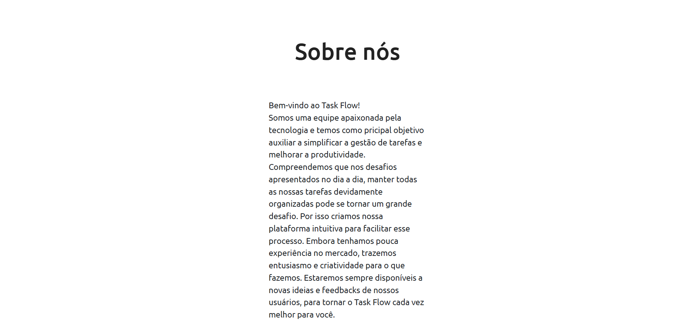

# PI 2º SEMESTRE DSM FATEC FRANCA - Aplicação WEB com Banco de Dados Relacional.

Este projeto se refere ao PI do Segundo Semestre da faculdade de DSM na Fatec Franca, o nome do projeto é Task Flow e é uma aplicação para gerenciamento de tarefas.

## Descrição:

O Task Flow foi criado com o objetivo de oferecer um sistema para gerenciar tarefas, focado para qualquer tipo de público, destacando-se empresas de médio/pequeno porte e usuários que possam utilizar proveito para o dia a dia.

A aplicação foi projetada utilizando as seguintes principais tecnologias:

* Visual Studio Code para editar o código-fonte;
* HTML5 como linguaggem de marcação;
* CSS como linguagem WEB de estilização;
* JavaScript para programar a interação do site;
* NodeJs para realizar o Back-end com conexão ao banco de dados;
* MySQL como SGBD para criação e gerenciamento do Banco de Dados.

## [Documentação do Projeto](https://github.com/ThiagoArchete/PI-2SEM-DSM/blob/adf9154d51b74182f583f16615c46114d61d9fdd/documenta%C3%A7%C3%A3o/Documenta%C3%A7%C3%A3o%20PI%202SEM%20DSM.pdf)

## [Protótipo inicial de baixa fidelidade](https://www.figma.com/design/6iBoxtXF9uAdYtrFlq5sbx/Untitled?node-id=62-11&t=FiCyhJxis3TbbRVv-1)

## [Vídeo sobre o projeto](https://youtu.be/uRsRIiItjuI)

## Aparência do Projeto:

## Instalação do Projeto:

* Clone os arquivos deste repositório na sua máquina e coloque em uma pasta;
* Execute o código do Banco de Dados (taskflow.sql) que está localizado na pasta "Banco de Dados" no repositório, em um SGBD (Preferencialmente o MySQL) online ou local;
* Certifique-se de estar com acesso a internet;
* Deixe o JavaScript de seu navegador ativado;
* Certifique-se de trocar a "password" no arquivo "conexao.js" na pasta "api/config" para condizer com sua senha do aplicativo MySQL;
* Execute no terminal do repositório o comando "npm install" para instalar a pasta "node_modules";
* Execute no terminal do repositório o comando "npm run devStart";
* Abra o navegador e insira a URL "http://localhost:3001/home" para verificar se o site está rodando na máquina;

## Clonar repositório:

Para baixar uma cópia basta baixar todos os arquivos presentes no repositório, em seguida executar o código SQL do Banco de Dados em um SGBD (Preferencialmente o MySQL que foi utilizado para a criação do mesmo), depois executar o comando "npm run devStart" no terminal do Back-End abrindo em um navagador (Chrome, Edge, FireFox, etc.) a URL "http://localhost:3001/home".

Certifique-se de que sua máquina esteja com acesso a internet, e o navegador suporte JavaScript, além do SGBD local para o Banco de Dados.

## Autores do projeto:
* Thiago Cunha Archete Silva - Desenvolvedor principal da ideia do projeto; Criação do Front-End; Participação na documentação do projeto.
* Paulo Ricardo de Azevedo Alvino - Criação do Back-End; Criação do Banco de Dados; Participação na Documentação do Projeto.
* Vitória Silva Ferreira de Oliveira - Participação na criação do Front-End; Participação na criação do Banco de Dados; Participação na Documentação do Projeto.

## Agradecimentos:

Queremos agradecer primeiramente a todos os professores da faculdade Fatec Franca que ministraram as aulas ao percorrer deste semestre, em destaque os professores das matérias-chave para o desenvolvimento do projeto:
* Professor Jorge - Engenharia de Software II;
* Professor Matheus - Banco de Dados Relacional;
* Professor Neto - Desenvolvimento Web II;

Como também agradecer aos nossos colegas e outros amigos que auxiliaram na criação deste projeto compartilhando seu conhecimento conosco. Desde já agradecemos.
